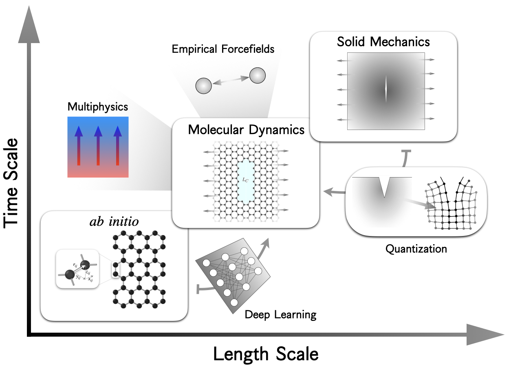

# Multiscale mechanics of thermal gradient-coupled graphene fracture based on molecular simulations
Source codes for study on thermal gradient effect on graphene crack propagation. For the preprint please check [2212.07897](https://arxiv.org/abs/2212.07897). 



Course project for [Multiscale Computational Mechanics](https://classes.cornell.edu/browse/roster/SP21/class/MAE/6260). If you use the code please cite:

```
@misc{zhai2022multiscale,
    title={Multiscale mechanics of thermal gradient coupled graphene fracture: A molecular dynamics study},
    author={Hanfeng Zhai and Jingjie Yeo},
    year={2022},
    eprint={2212.07897},
    archivePrefix={arXiv},
    primaryClass={cond-mat.mtrl-sci}
}
```
